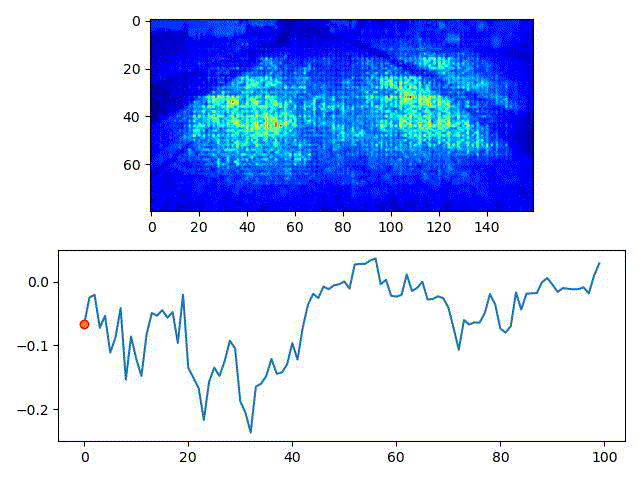

# ASE 2022
Artifacts accompanying the paper *"ThirdEye: Attention Maps for Safe Autonomous Driving Systems"* submitted for publication at ASE 2022.

## Overview

Our tool ThirdEye leverages the attention maps by the explainable AI algorithms SmoothGrad and turn them into a confidence 
score to automatically predict incoming failures of a DNN-based autonomous driving system (ADS). The figure below shows the attention maps of a confident ADS.



## Dependencies

**Software setup:** We adopted the PyCharm Professional 2020.3, a Python IDE by JetBrains.

First, you need [anaconda](https://www.continuum.io/downloads) or [miniconda](https://conda.io/miniconda.html) installed on your machine. Then, you can create and install all dependencies on a dedicated virtual environment, by running one of the following commands, depending on your platform.

```python
# macOS
conda env create -f environments.yml 

# Windows
conda env create -f windows.yml
```

Alternatively, you can manually install the required libraries (see the contents of the *.yml files) using ```pip```.

**Hardware setup:** Training the DNN models (self-driving cars and autoencoders) on our datasets is computationally expensive. Therefore, we recommend using a machine with a GPU. In our setting, we ran our experiments on a machine equipped with a AMD Ryzen 5 processor, 8 GB of memory, and an NVIDIA GPU GeForce RTX 2060 with 6 GB of dedicated memory.

## Replicate ASE 2022 experiments

### Datasets & Simulator

Driving datasets, self-driving car models, and simulator have a combined size of several GBs. The driving simulator, despite open-source, cannot be anonymized. We will make all artifacts available upon paper's acceptance. 

### Mutants

We use the following mutation operators:

* udacity_add_weights_regularisation_mutated0_MP_l1_3_1
* udacity_add_weights_regularisation_mutated0_MP_l1_l2_3_2
* udacity_add_weights_regularisation_mutated0_MP_l2_3_0
* udacity_change_activation_function_mutated0_MP_exponential_4_0
* udacity_change_activation_function_mutated0_MP_hard_sigmoid_4_0
* udacity_change_activation_function_mutated0_MP_relu_4_2
* udacity_change_activation_function_mutated0_MP_selu_4_0
* udacity_change_activation_function_mutated0_MP_sigmoid_4_3
* udacity_change_dropout_rate_mutated0_MP_0.125_0.125_6_2
* udacity_change_dropout_rate_mutated0_MP_1.0_1.0_6_1
* udacity_change_activation_function_mutated0_MP_softmax_4_4
* udacity_change_activation_function_mutated0_MP_softsign_4_5
* udacity_change_activation_function_mutated0_MP_tanh_4_2
* udacity_change_dropout_rate_mutated0_MP_0.25_0.25_6_7
* udacity_change_dropout_rate_mutated0_MP_0.75_0.75_6_0
* udacity_change_label_mutated0_MP_12.5_4
* udacity_change_label_mutated0_MP_25.0_1
* udacity_change_loss_function_mutated0_MP_mean_absolute_error_2


### Evaluation Scripts

For replicating the RQs, you can run:

* For ThidEye HA/HD, run the file `scripts/evaluate_failure_prediction_heatmaps_scores_compute_all.py`
* For ThidEye HRL, run the file `scripts/evaluate_failure_prediction_vae_on_heatmaps_compute_all.py`
* For SelfOracle, run the file `scripts/evaluate_failure_prediction_selforacle_compute_all.py`


